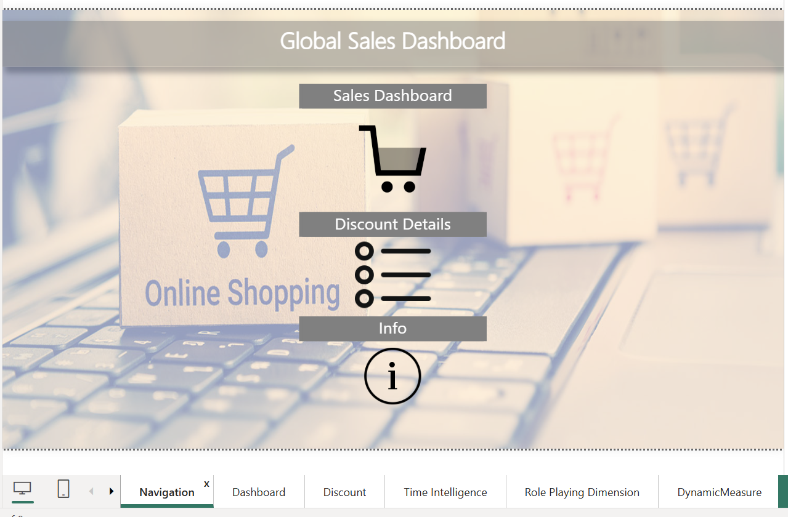
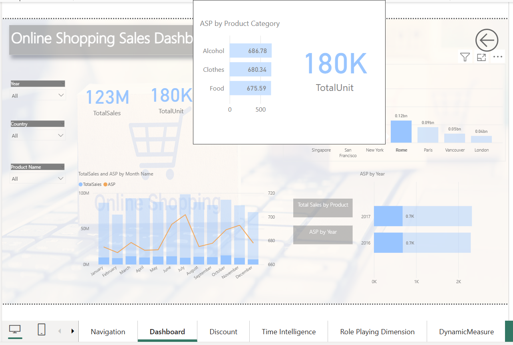
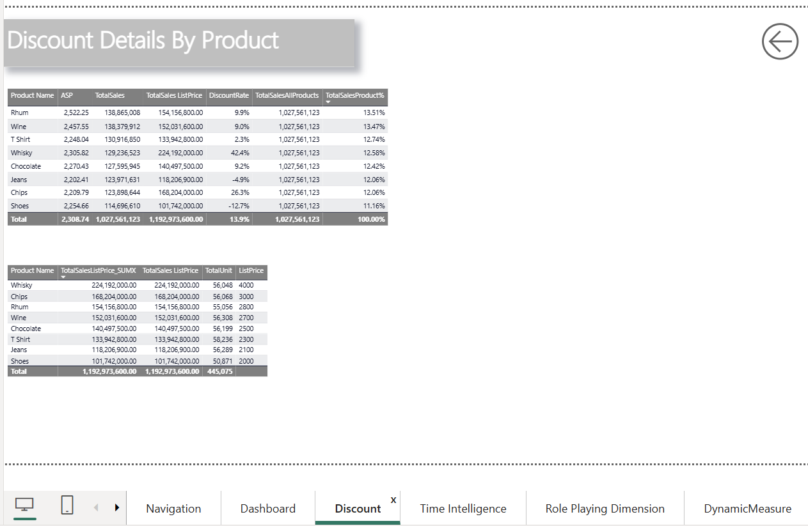
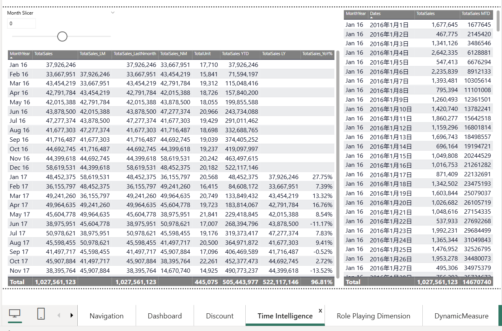

# 🛍️ Global Sales Dashboard — Power BI Project

## 📌 Overview

This Power BI project presents a comprehensive **interactive dashboard** for analyzing global e-commerce sales data. It allows users to explore sales performance across various **countries**, **cities**, **products**, and **time dimensions**, offering rich insights for both strategic and operational decisions.

Designed with advanced Power BI features, this dashboard showcases a professional-level approach to **data storytelling**, **visual structure**, and **analytical depth**.

---

## ✨ Highlights & Advanced Features

| Feature | Description |
|--------|-------------|
| **Navigation Page** | User-friendly landing page using **buttons** and **bookmarks** for smooth report navigation |
| **Bookmark Layering** | Overlay visuals within a single page using dynamic **bookmark states** to toggle content |
| **Sales Dashboard** | Interactive KPIs including **Total Sales**, **Total Units**, and **ASP**, segmented by **time**, **region**, and **product** |
| **Time Intelligence** | Implements year-over-year growth (YoY%), month-to-date (MTD), last month, and cumulative sales (YTD, LY) using **DAX** |
| **Dynamic Measures** | Switch between key metrics using slicers or buttons for customized insights |
| **Role-Playing Dimensions** | Uses multiple date relationships to support different time-based analysis perspectives |
| **Discount Analysis** | Displays discount rates, list prices, and contribution per product to optimize pricing strategy |
| **Info Page** | Definitions of KPIs and business logic |
| **Advanced Tooltip** | Embedded visual tooltips for contextual insights without cluttering the main view |

---

## 🧩 Data Source

- Simulated dataset in **Excel**

---

### 🧠 DAX Formulas & Data Modeling

The original dataset included only basic attributes such as `Quantity`, `Sales Amount`, and `List Price`. All business-critical metrics were created using **DAX**, including:

- `Total Sales = Quantity * List Price`
- `Discount Rate = 1 - Sales Amount / Total Sales`
- `ASP (Average Selling Price) = Sales Amount / Quantity`
- `YoY%`, `YTD`, `MTD` using time intelligence functions
- Dynamic Measures for switching between KPIs with slicers

This showcases my ability to not just visualize data but to **build robust data models** and derive **actionable business insights** using Power BI.

---

## 🛠️ Tech Stack

- Power BI Desktop  
- DAX (Data Analysis Expressions)  
- Excel (for data modeling)

---

## 📸 Preview

### 📊 Navigation Page

### 🛒 Sales Dashboard

### 💸 Discount Details

### ⏱️ Time Intelligence

---

## 📍 Key Learnings

This project helped me reinforce the best practices of:
- Building a **narrative-driven report** using visual hierarchy
- Applying **time intelligence functions** with business relevance
- Creating **reusable bookmarks** and **dynamic pages** for efficiency
- Designing dashboards that balance clarity and analytical depth

---

## 📌 Next Steps

- Add **Power Automate** integration for anomaly detection alerts  
- Extend data source with **real-world APIs** or **SQL databases**  

